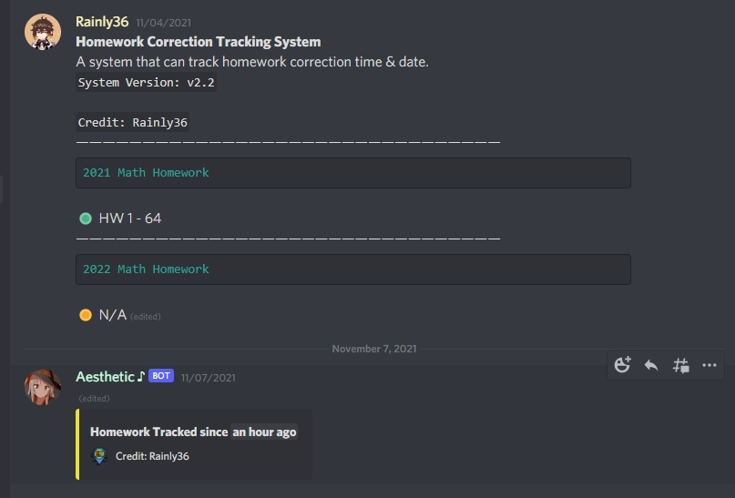

# Homework Correction Tracking System
This is a system that can track your homework correction time & date 

 

### Warning 
This setup is **extremely hard** for person that do not have *any* experience in Discord.js library or hosting bot. 

 

### Requirement
- A Discord Bot (Recommended Video: [Make A Discord Bot](https://www.youtube.com/watch?v=_woxAkO0Ywg))
- Your bot can online 24/7 
- Common sense 
- A server that you owned (We need a channel later)
- Node.js Version 17 or latest 
- Some experience in discord.js 

Make sure you done all of it.

 

### Ready
1. Clone this repo to your IDE 

 

### Start
1. Copy your bot token from [Discord Developer Portal](https://discord.com/developers/applications)
2. Inside `/storage/config.json` file, paste it in "PASTE-YOUR-BOT-TOKEN-HERE"

3. Open a new channel and name it whatever you want
4. Send a message in that new channel. The message content needs to be `$botMsg`. The bot will send a msg and that is the msg 
5. Copy the message id that bot sended.
6. Copy the channel id in that new channel.
7. Inside `/index.js`, paste the channel id and message id seperately in the red box given: 

8. Start your bot and wait until the bot fully deployed.
9. Edit the message that you sended in new channel (step 4), The content can be anything. You will realise that the message is changed to the tracking embed.

 

### Completed
Thats it. Now you can edit your messages and the tracking system will automatically update your changes. If you have any technique problems or questions, please [join this server](https://discord.gg/d9Wxzyyfpc) and i will help you one by one. 
